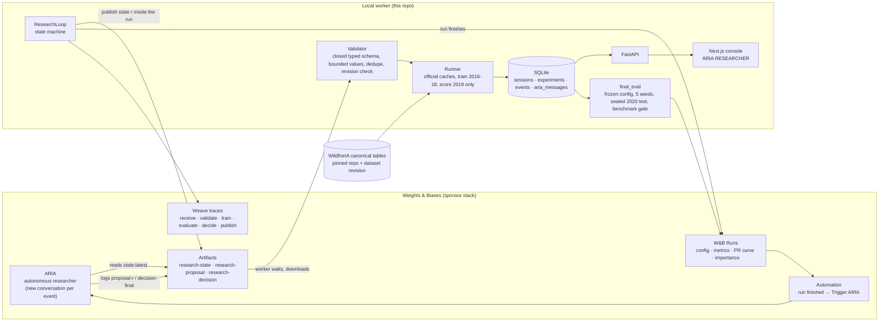

# ARIA Wildfire Researcher

Launch execution, ARIA's retrospective/report, saved W&B workspaces, model Registry,
operational alerts and the Weave audit: [OPERATIONS.md](OPERATIONS.md).

Current safeguards and claim limitations: [AUDIT_FIXES.md](AUDIT_FIXES.md).
Historical test scores are preserved; the UI no longer treats legacy flags as
certified superiority. Run `python -m wildfire_researcher.cli verify-data` before
new official evaluation. Import Replay JSON supports playback without the backend.

**Can an AI agent beat the published wildfire escape benchmark?**
An autonomous research loop over the WildfireIA benchmark in which **W&B's ARIA** chooses every hypothesis, experiment and KEEP/REJECT decision. Built for the CoreWeave × Weights & Biases Agent Loops Hackathon.

```
OBSERVE → HYPOTHESIZE → DESIGN ONE EXPERIMENT → VALIDATE → TRAIN → EVALUATE → ARIA KEEP/REJECT → NEXT QUESTION
```

## 1. The problem

When a naturally caused wildfire is discovered, will initial attack fail to contain it? [WildfireIA](https://github.com/LabRAI/WildfireIA) (LabRAI, Florida State University) turns this into an event-level benchmark: 38,128 FPA-FOD wildfire events (2016–2020) aligned with public discovery-time information (FIRMS/VIIRS thermal detections, gridMET weather and fire danger, LANDFIRE fuel and vegetation, topography, OpenStreetMap access, WorldPop population). The label is 1 if the fire's final size reached 50 ha and 0 if it stayed under 10 ha; only information available at discovery is allowed.

## 2. The published benchmark

**0.533 test AUPRC** (XGBoost, full input, five-seed mean) on the official 2020 test year. Initial-attack failures are rare (about 8% of events), so AUPRC is the metric that matters: it measures how well escapes are ranked above contained fires.

## 3. Why it matters

Escapes are the fires that become large, costly and dangerous. A better discovery-time ranking helps prioritise scarce initial-attack resources. This is a research prototype on historical public data; see the footer of the UI and §15.

## 4. Architecture



The worker never chooses experiments. It validates, executes, persists and presents. An explicitly labelled development stub (`ARIA_MODE=fallback`) exists only for offline tests and is never the judged researcher.

## 5. The autonomous research loop

1. **Baseline** (fixed, not ARIA's choice): metadata-only logistic regression on the official cache. Measured validation AUPRC **0.184**.
2. The worker publishes the complete **research state** (objective, protocol, capability manifest, full history with confusion matrices, error breakdowns by eligible discovery-time groups, feature importance, budget, rejection feedback, instructions) as a W&B artifact inside the run, then the run finishes.
3. The **Automation** invokes **ARIA**, which reads the state in its own environment, decides KEEP/REJECT for the last experiment with reason, learning and next question, and designs **one** next experiment (observation → falsifiable hypothesis → expected result → configuration).
4. The worker **validates** the proposal against a closed schema (model, official feature protocol, weather window, bounded hyperparameters, no duplicates, correct session and revision). Invalid proposals get structured feedback and a retry; the worker never substitutes its own choice.
5. **Train / evaluate** on the official train/validation years with the official metric code; log the W&B run and Weave traces; persist; publish the next state revision. Repeat until the budget is exhausted.
6. ARIA gives a **final decision** and recommends one configuration to freeze. `final-eval` scores that single configuration on the sealed 2020 test year over five seeds. The backend gates `PUBLISHED BENCHMARK BEATEN` (protocol-matched and mean test AUPRC strictly above 0.533).

### Verified live result (session `wf-20260913-live1`, budget 3, real ARIA)

| Exp | Chosen by | Change | Validation AUPRC | ARIA decision |
|---|---|---|---:|---|
| 0 | fixed baseline | logistic regression · metadata | 0.1842 | KEEP (reference) |
| 1 | ARIA | features metadata → all | 0.3972 | KEEP |
| 2 | ARIA | model logistic regression → XGBoost | 0.4830 | KEEP |
| 3 | ARIA | max_depth 4 → 3 | 0.4867 | KEEP, recommended to freeze |

Official final evaluation of frozen exp-003 (XGBoost, full input, depth 3): **mean test AUPRC 0.5413 ± 0.0024 over seeds 553371–553375** (per seed 0.5452, 0.5421, 0.5398, 0.5404, 0.5392), i.e. **+0.8 points over the published 0.533** under the official split, cohort, preprocessing and metric code. Caveats that travel with this claim: the official five-seed list is not public, so seed-to-seed variance (ours ±0.24 pts) matters, and the margin is small. Evidence: [W&B project](https://wandb.ai/ali-amjad52114-r42/wildfire-autonomous-researcher), [Weave traces](https://wandb.ai/ali-amjad52114-r42/wildfire-autonomous-researcher/weave/traces), [final evaluation run](https://wandb.ai/ali-amjad52114-r42/wildfire-autonomous-researcher/runs/4gvl293f), artifacts `wf-20260913-live1-proposal-r1..r3`, `wf-20260913-live1-decision-final`, `wf-20260913-live1-final-evaluation`.

### Second live session (`wf-20260913-104003-2c71`, budget 12, started from the UI, generic automation)

ARIA reproduced the first three gains, then rejected five single-variable variations on evidence (depth 2, min_child_weight 3, colsample 0.6, dropping access features, learning rate 0.02), discovered that lowering `scale_pos_weight` (12.2 → 6 → 3 → 1.5) kept improving validation AUPRC to **0.4994**, and stopped when 0.75 reversed the trend. It recommended freezing exp-011. Official final evaluation: **mean test AUPRC 0.5437 ± 0.0017 over five seeds (+1.07 pts vs 0.533)**, [run uqf6weq6](https://wandb.ai/ali-amjad52114-r42/wildfire-autonomous-researcher/runs/uqf6weq6). Full table in `TEST_REPORT.md`.

## 6. WildfireIA data source

Official repository pinned at commit `aba9be9e…`, dataset `WildfireIA/Anonymous-WildfireIA` revision `cd1fcad8…`. Only the event-level canonical tables (~40 MB) are downloaded; the official `dataloader.py` builds every model-ready cache. Full protocol notes and deviations: `BENCHMARK_PROTOCOL.md`.

## 7. W&B integration

Every experiment is a W&B run (group = session) with session/experiment/parent identity, ARIA's hypothesis and reason, the canonical configuration, validation metrics, deltas, runtime, PR curve, confusion matrix, feature importance, `score_kind` and `benchmark_comparable=false`. Research state, proposals, decisions, predictions and the final evaluation are versioned artifacts. Nothing sensitive is logged; the API key is read from the environment only.

## 8. Weave integration

Weave ops trace what happens locally for every cycle: `receive_aria_output` (artifact provenance and ARIA's verbatim output), `validate_experiment`, `execute_training`, `evaluate_result`, `record_aria_decision`, `publish_research_state`. `execute_training`, `evaluate_result` and `publish_research_state` are attached to the experiment's W&B run; `receive_aria_output`, `validate_experiment` and `record_aria_decision` happen between runs and are project-level Weave calls. ARIA's internal reasoning runs in W&B's environment and is not instrumented here; no spans are fabricated for it.

## 8b. Evaluating ARIA itself (Weave Evaluations)

`python scripts/run_agent_evals.py` builds a Weave dataset of every real exchange (state ARIA read →
output ARIA published) and runs deterministic scorers: contract validity, one-variable discipline,
numeric grounding, decision consistency with the measured delta (flagging decisions inside seed noise),
prediction accuracy against ARIA's own stated target, and novelty. Results live in the project's Evals tab
(`aria-agent-eval-v2`). Re-running it after a prompt or validator change is the regression test for the loop.
`--llm-judge` adds a W&B Inference judge for hypothesis falsifiability.

## 9. Setup

```bash
python -m venv .venv && .venv\Scripts\activate           # Windows
pip install -r requirements.txt
git submodule update --init WildfireIA                    # pinned LabRAI/WildfireIA @ aba9be9e (or clone with --recurse-submodules)
python -m wildfire_researcher.cli setup-data              # ~40 MB canonical tables + official caches
cd frontend && npm install && cd ..
```

## 10. Environment variables

See `.env.example`. `WANDB_API_KEY` (env or Windows per-user variable), `WANDB_ENTITY`, `WANDB_PROJECT`, `ARIA_MODE` (`connected` | `fallback`), `EXPERIMENT_BUDGET`, `ARIA_WAIT_SECONDS`, `ARIA_POLL_SECONDS`, `ARIA_MAX_REJECTIONS`, `FAST_MODE`.

## 11. Running locally

```bash
python -m pytest -q                                       # 50 tests, ~2.5 min (real lightweight training, no network)
```

## 12. Running the autonomous loop (CLI, independent of the UI)

```bash
python -m wildfire_researcher.cli research --budget 15          # new session, real ARIA
python -m wildfire_researcher.cli status --session <id>
python -m wildfire_researcher.cli resume --session <id>         # after a crash, cancel or ARIA timeout
python -m wildfire_researcher.cli final-eval --session <id>     # once: frozen config on the sealed test year
python -m wildfire_researcher.cli replay-export --session <id>  # artifacts/<id>/replay.json
python -m wildfire_researcher.cli automation-prompt --session <id>
```

The W&B Automation must exist before the baseline run finishes; the generic one described in `AUTOMATION.md` covers every auto-named session.

## 13. Starting frontend and backend

```bash
python -m uvicorn wildfire_researcher.api:app --host 127.0.0.1 --port 8000
cd frontend && npm run dev            # http://localhost:3000 (rewrites /api → backend)
```

The console shows the published benchmark, current best (validation) or official test result, delta (only after final evaluation), status, the ARIA RESEARCHER panel (observation, hypothesis, experiment, status, result, decision, learning, next question), the research trajectory with the labelled 53.3% test reference line, experiment history with details, what the agent is learning, dataset context, and the event log. Sessions survive refresh and process restarts (SQLite).

## 14. Demo / replay mode

`REPLAY VERIFIED RUN` steps through the stored experiments of a completed session with no retraining and no ARIA calls; the mode pill reads `REPLAYING VERIFIED RUN`. Sessions driven by the development stub are labelled `DEVELOPMENT FALLBACK (NOT ARIA)`. See `DEMO.md`.

## 15. Scientific limitations

- Validation AUPRC (2019) is a selection metric; only the one-time official test evaluation of a frozen configuration is comparable with 0.533.
- The official seed list is unpublished; our five seeds give ±0.24 pts.
- The official `train.py` on xgboost 3.x silently drops early stopping; our runner keeps the intended 50-round early stopping (documented in `BENCHMARK_PROTOCOL.md`).
- Tabular representation only; temporal/spatial/spatiotemporal models were not explored.
- Training ran on a laptop CPU; CoreWeave execution was not set up (no cluster credentials or budget were available). The executor is an adapter (`runner.run_experiment`) so a hosted executor can replace it.
- ARIA's internal reasoning is not traced; its outputs and conversation ids in W&B automation history are the provenance.

*Research prototype using historical public data. Not for operational wildfire response.*
# Audit follow-up

Read [AUDIT_FIXES.md](AUDIT_FIXES.md) for the current evaluation safeguards and
claim/replay behavior. It supersedes older benchmark-certification wording below.
Historical scores remain unchanged; a numeric result above 0.533 is not presented
as a certified superiority claim. Run `python -m wildfire_researcher.cli verify-data`
before any new official evaluation. Use **IMPORT REPLAY JSON** for playback without
the backend/database once the frontend is loaded.
