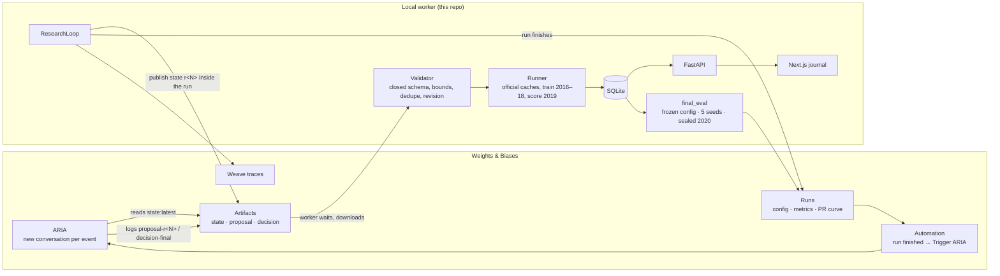

# ARIA Wildfire Researcher

**An autonomous research loop in which W&B's ARIA is the scientist.** ARIA reads the
measured state of a study, writes an observation, states a falsifiable hypothesis,
designs one experiment, decides KEEP or REJECT once the number comes back, and asks
the next question. Beyond the autonomous loop, ARIA answers questions about selected
runs, proposes experiments from subgroup errors, plans bounded studies, and writes
evidence-linked research interpretations. Persistent findings, paired-seed verification,
reviewed execution, and frozen reports connect those interactions across sessions.
The code supplies a fixed baseline and enforces the execution and evidence contracts;
subsequent connected research proposals come from ARIA.

The study: can an agent beat the published WildfireIA benchmark for predicting
initial-attack failure on US wildfires? Published reference: **0.533 test AUPRC**.
Built for the CoreWeave × Weights & Biases Agent Loops Hackathon.

```
OBSERVE → HYPOTHESIZE → DESIGN ONE EXPERIMENT → VALIDATE → TRAIN → EVALUATE → ARIA KEEP/REJECT → NEXT QUESTION
```

| Read next | For |
|---|---|
| [AUTOMATION.md](AUTOMATION.md) | How ARIA is invoked through W&B Automations and artifacts, and how to reproduce it |
| [OPERATIONS.md](OPERATIONS.md) | The second execution path (W&B Launch), ARIA's retrospective report, model Registry, alerts |
| [BENCHMARK_PROTOCOL.md](BENCHMARK_PROTOCOL.md) | The official WildfireIA protocol as verified against the pinned code |
| [AUDIT_FIXES.md](AUDIT_FIXES.md) | Evaluation safeguards and the exact limits on any benchmark claim |
| [BENCHMARK_CONTRACT.md](BENCHMARK_CONTRACT.md) | The benchmark library: discovery, import, provenance, executability |
| [TEST_REPORT.md](TEST_REPORT.md) | Every verification run, with commands and outcomes |
| [DEMO.md](DEMO.md) | A three-minute walkthrough |
| [Detailed ARIA integration](#13-the-six-assistant-workflows-in-detail) | All six workflows, responsibility boundaries, transport, persistence, API, and evidence |
| [Implementation and acceptance](docs/aria-expansion/IMPLEMENTATION.md) | Source-level implementation record and four validated real ARIA responses |
| [Latest end-to-end run](docs/aria-expansion/END_TO_END.md) | Actual training, four repeated-seed jobs, exported report, and rejected responses |
| [Two-minute demo](docs/demo/aria-research-demo.mp4) | 1080p captioned walkthrough of real screens; no audio |

**Evidence summary, 13 September 2026:** the six assistant workflows are implemented,
four real assistant response kinds have validated artifact provenance, and a reviewed
ARIA proposal was executed on the canonical data followed by four real verification
jobs. The latest candidate improved validation AP on both repeated seeds, but did
**not** meet its California subgroup goal. W&B report publication is implemented and
adapter-tested; it was not exercised as a live publication in this acceptance run.
The [evidence index](#17-real-execution-evidence-and-what-it-proves) distinguishes
implementation, successful live use, failed validation, and work still outside scope.

---

## 1. ARIA is the researcher

Most "AI does research" systems either search a parameter grid or let a model rewrite
the training script. This one gives an agent the role a human researcher plays in an
empirical study and makes the surrounding machinery enforce the discipline a careful
researcher would want.

**What ARIA decides, every cycle:**

- **Observation.** What the last measurement showed, in numbers: score, delta, missed
  escapes, false alarms, train-to-validation gap, which groups failed.
- **Hypothesis.** One falsifiable expectation with a stated target.
- **Experiment.** Exactly one configuration from an allowed menu, usually one variable
  changed against the incumbent.
- **Decision.** KEEP or REJECT for the previous experiment, with a reason.
- **Learning.** What the result taught, independent of whether it was kept.
- **Next question.** Where the study goes from here.
- **Final recommendation.** When the budget is spent, which configuration to freeze
  for the single official test evaluation.

**What the code enforces:** the allowed scientific action space, fixed evaluation
protocol, evidence eligibility, budgets, and numerical ranking. The baseline is fixed in advance and
labelled as not ARIA's choice. After that, if ARIA is silent, the worker waits. If ARIA
proposes something invalid, the worker sends structured feedback and waits again. It
never substitutes its own idea. A scripted stub exists for offline tests, and every
session it drives is labelled `DEVELOPMENT FALLBACK (NOT ARIA)`.

### ARIA in its own words

These are excerpts of outputs stored from real sessions. Ellipses indicate omissions.

Rejecting a change on evidence (session `wf-20260913-162633-243a`, experiment 3):

> Exp-003 failed its primary criterion: validation AUPRC decreased from the 0.2662 best
> to 0.2592 and did not reach the 0.275 target. Its smaller train-validation gap and 19
> fewer false negatives do not outweigh the lower ranking score, especially because
> false positives increased by 95.

Reasoning from the error profile to a hypothesis (session `wf-20260913-live1`, experiment 3):

> Exp-002 improved validation AUPRC from 0.3972 to 0.4830 (+0.0858) and reduced false
> negatives from 262 to 235, while reaching train AUPRC 0.7269 versus validation AUPRC
> 0.4830 (a 0.2439 gap). The model stopped at iteration 459 of 1000, so additional
> estimator capacity was not the limiting factor; the remaining train-validation gap
> motivates testing lower tree complexity.

Keeping a small gain while being explicit about what it is not (final decision, live1):

> KEEP exp-003 as the final frozen configuration because it is the numeric validation
> winner … The gain is smaller than the aspirational 0.490 target, but it is positive
> under the official selection metric and no further experiments remain in budget.

Refusing to conflate validation with the published test number (recorded next question, session `wf-20260913-162633-243a`):

> After freezing exp-005 without further validation tuning, what AUPRC does it achieve
> under the sealed official 2020 test evaluation, keeping that result distinct from
> the 0.4881 validation score and the published 0.533 test benchmark?

### What ARIA has found so far

Selected recorded real-ARIA sessions through the Automation and W&B Launch paths.
All scores below are **validation AUPRC on the official 2019 year**, the selection
metric. They are not comparable with 0.533, which is a test-year number.

| Session | Budget | Path | ARIA's trajectory | Best | Recommended |
|---|---:|---|---|---:|---|
| `wf-20260913-live1` | 3 | Automation | metadata → all features → XGBoost → depth 3 | 0.4867 | exp-003 |
| `wf-20260913-104003-2c71` | 12 | Automation | same three gains, then five single-variable REJECTs, then a `scale_pos_weight` sweep 12 → 6 → 3 → 1.5 that kept improving until 0.75 reversed it | 0.4994 | exp-011 |
| `launch-20260913-133047-0467` | 2 | Launch | full-feature XGBoost, then `scale_pos_weight` 1.5 | 0.5000 | step 3 |
| `wf-20260913-162633-243a` | 5 | Automation | XGBoost on metadata → add fuel → depth 3 (REJECT) → all features → `min_child_weight` 5 | 0.4881 | exp-005 |

Two of those recommendations were scored once on the sealed 2020 test year over five seeds:

| Frozen configuration | Mean test AUPRC | Seeds | Published |
|---|---:|---|---:|
| live1 exp-003: XGBoost, all features, depth 3 | 0.5413 ± 0.0024 | 553371–553375 | 0.533 |
| 104003 exp-011: XGBoost, all features, depth 3, `scale_pos_weight` 1.5 | 0.5437 ± 0.0017 | 553371–553375 | 0.533 |

Both are recorded above the reference. Neither is presented as a certified claim of
beating the benchmark, for reasons in §6. Evidence: [W&B project](https://wandb.ai/ali-amjad52114-r42/wildfire-autonomous-researcher),
[Weave traces](https://wandb.ai/ali-amjad52114-r42/wildfire-autonomous-researcher/weave/traces),
final-evaluation runs [4gvl293f](https://wandb.ai/ali-amjad52114-r42/wildfire-autonomous-researcher/runs/4gvl293f)
and [uqf6weq6](https://wandb.ai/ali-amjad52114-r42/wildfire-autonomous-researcher/runs/uqf6weq6).

### ARIA looking at its own work

ARIA also wrote a retrospective over a snapshot of 49 runs: 21 measured experiments,
17 proposals, three sessions. It identified the 13 distinct configurations, the
incumbent-relative deltas, and its own decision consistency, and corrected two of its
own misreadings within the same report. See [OPERATIONS.md](OPERATIONS.md) for the
report link and the checked artifact.

---

## 2. How ARIA is invoked

This repository invokes ARIA through **W&B Automations**, rather than a direct
model-completion API. ARIA acts when an Automation fires on a
project event, and each event starts a **new conversation**. So the worker sends the
complete research state every cycle.



**One cycle, step by step:**

1. The worker finishes an experiment and, inside that W&B run, publishes
   `<session>-state` revision N: objective, protocol, capability manifest, full history
   with confusion matrices and error breakdowns by eligible discovery-time groups,
   feature importance, budget, any rejection feedback, and instructions.
2. The run finishes. The Automation matches its name and triggers ARIA with an Automation
   prompt that tells it where the state is and what to produce.
3. ARIA, in W&B's environment, downloads the state, reasons, and logs
   `<session>-proposal-r<N>` (or `<session>-decision-final` when the budget is spent).
   The artifact must echo the session id and revision N.
4. The worker polls for that artifact, validates it, records the KEEP or REJECT for the
   previous experiment, claims the new experiment transactionally, trains, scores, and
   publishes revision N+1.

**When W&B drops an event.** It happens. After `ARIA_NUDGE_SECONDS` (180) with no
answer, the worker republishes the state through a control run, which is a fresh
event. Delivery and response latency depend on the external service. After
`ARIA_MAX_NUDGES` the session goes to a resumable error state. The worker still never
picks an experiment.

**When ARIA proposes something invalid.** The rejection is structured
(`code`, `field`, `message`), stored, put into the next state under
`rejected_messages_at_this_revision`, and republished. Three consecutive invalid
proposals stop the session. This research-loop validation path is separate from the
assistant response validator; rejected assistant exchanges are documented in §17.

A second invocation path exists: ARIA submits each step to a **W&B Launch** queue
itself, monitors the job, reads the new state, and submits the next. Same validator,
same trainer. It ran one complete session end to end. Details in
[OPERATIONS.md](OPERATIONS.md).

---

## 3. The contract ARIA works under

ARIA's freedom is real but bounded, and the bounds are what make every experiment
comparable and every claim checkable.

**The capability manifest** travels with every state. It lists two model families
(logistic regression, XGBoost) with typed, bounded hyperparameters and defaults, the 21
official WildfireIA feature protocols with descriptions, allowed weather windows, and
the rules: one model, one protocol, one window, prefer one change per experiment,
duplicates are rejected, the objective is validation AUPRC, the test year is sealed.

**A proposal** is a closed JSON object:

```json
{
  "schema_version": 1,
  "session_id": "wf-…", "state_revision": 4, "proposal_id": "…",
  "observation": "…", "hypothesis": "…", "expected_result": "…", "reason": "…",
  "experiment": { "model": "xgboost", "feature_protocol": "all", "weather_days": 5,
                  "hyperparameters": { "min_child_weight": 5.0 } },
  "previous_decision": { "experiment_id": "exp-004", "decision": "KEEP",
                         "reason": "…", "learning": "…", "next_question": "…" }
}
```

The validator rejects unknown keys, wrong types (a bool where an int is expected, a
string "5" for 5), NaN or infinity, out-of-range values, unsupported models or
protocols, stale revisions, wrong sessions, duplicate proposal ids, duplicate canonical
configurations, and decisions that don't target the last completed experiment. ARIA's
text is stored verbatim as data. Nothing in it is ever executed or used as a path.

**A final decision** names one completed experiment to freeze. Only that
configuration can be evaluated on the test year, and only once.

---

## 4. Reading ARIA's work

- **The research journal** (Next.js console). One entry per experiment: ARIA's
  observation, hypothesis, configuration, measured result, decision, learning, and
  next question. A live session shows the current state. Completed sessions replay
  from stored records with no retraining and no ARIA calls, including from an
  exported JSON with the backend switched off.
- **W&B runs.** Every experiment is a run whose config carries ARIA's hypothesis and
  reason, with validation metrics, deltas, PR curve, confusion matrix, feature
  importance, `score_kind`, and `benchmark_comparable=false`.
- **W&B artifacts.** Every state revision, proposal, and decision is versioned with a
  digest. The worker stores the digest and file hash of everything it accepted.
- **Weave traces.** `receive_aria_output`, `validate_experiment`,
  `execute_training`, `evaluate_result`, `record_aria_decision`,
  `publish_research_state`, linked to the experiment run and carrying session and
  revision attributes. ARIA's internal reasoning runs in W&B's environment and is not
  traced here. No spans are fabricated for it.
- **Weave evaluations of ARIA itself.** `python scripts/run_agent_evals.py` builds a
  dataset of every real exchange and scores contract validity, one-variable
  discipline, numeric grounding, decision consistency against the measured delta
  (flagging decisions inside seed noise), accuracy against ARIA's own stated target,
  and novelty. Rerun it after any prompt or validator change.
- **Automation history** in the W&B UI links every dispatch to its ARIA conversation.
  Launch-path runs carry native `_wb_agent` thread and turn identities.

---

## 5. The guardrails that keep ARIA honest

These are enforced in code, not in the prompt.

| Guardrail | Where |
|---|---|
| Test year never loaded during research; the loader returns train and validation only | `protocol.load_research_splits` |
| Leakage columns (final size, containment time, MTBS ids) removed by the official loader; cannot be requested | official `dataloader.py`, pinned commit |
| Official metric code, official preprocessing fit on train only | `protocol.classification_metrics`, official `train.py` |
| Numeric best tracked separately from ARIA's KEEP/REJECT; a kept regression never becomes the best | `state.numeric_best` |
| One frozen configuration, five predeclared seeds, transactional freeze record, repeat runs return the stored result | `final_eval.prepare_freeze` |
| Dataset and cache hashes verified against the pinned Hugging Face revision before test access | `integrity.verify_dataset`, `verified_cache` |
| Backend gates any "benchmark beaten" flag; the UI never computes it | `final_eval.evaluation_view` |
| One worker per machine, training in a bounded child process, cancel and resume without duplicate experiments | `execution.worker_lease`, `bounded` |

---

## 6. What a result here does and does not mean

- Validation AUPRC on 2019 is a selection metric. Only the one-time test evaluation of
  a frozen configuration compares with 0.533.
- The paper's five seeds are unpublished. Ours are 553371–553375, and the spread is
  about ±0.24 points against margins of 0.8 and 1.1 points.
- The official script silently drops early stopping on xgboost 3.x. Our runner keeps
  the intended 50-round stop. Documented in [BENCHMARK_PROTOCOL.md](BENCHMARK_PROTOCOL.md).
- The second search began after the first test result was visible in the same W&B
  project. Neither is a fully untouched confirmatory evaluation.
- Therefore both recorded test means carry `claim_eligible = false`. They are
  descriptive results above the reference, and the app says so wherever they appear.

---

## 7. The benchmark library

WildfireIA is one executable benchmark. Around it sits a small library layer for
discovering and importing others: Hugging Face, OpenML, GitHub, and paper DOIs, with
field-level provenance, a six-field readiness check, and a strict executability gate.
Only the exact pinned WildfireIA can start research today. Everything else can be
reviewed and saved as a project specification and waits for an executor adapter.
Searches return candidates; nothing enters the library without an explicit import.
Contract and boundaries: [BENCHMARK_CONTRACT.md](BENCHMARK_CONTRACT.md).

---

## 8. Design choices

The research action is a configuration, not arbitrary generated training code. ARIA
chooses from supported models, feature protocols, and bounded hyperparameters. It
records a written KEEP/REJECT decision while the application independently maintains
the numerical best. This supports inspecting disagreements between a narrative and
the measured objective.

The output is both a candidate configuration and a research record: observations,
hypotheses, decisions, failed ideas, exact measurements, and provenance. Restricting
the action space makes execution reproducible and validation enforceable. It does
not prove that all leakage, statistical bias, or scientific reasoning errors are
impossible; those limitations remain explicit in the result and report.

---

## 9. Setup

```bash
python -m venv .venv && .venv\Scripts\activate           # Windows
pip install -r requirements.txt
git submodule update --init WildfireIA                    # pinned LabRAI/WildfireIA @ aba9be9e
python -m wildfire_researcher.cli setup-data              # ~40 MB canonical tables + official caches
python -m wildfire_researcher.cli verify-data             # hash check against the pinned revision
cd frontend && npm install && cd ..
```

Environment variables are documented in `.env.example`. `WANDB_API_KEY` is read from
the environment or the Windows per-user variables and is never logged. `ARIA_MODE`
is `connected` for real ARIA or `fallback` for the labelled offline stub.

**Before the first session**, create the W&B Automation once: event *Run status
   change → Finished*, run-name filter `^wf-.*-(exp-\d+|control-r\d+)$`, action
*Trigger ARIA*, prompt from `python -m wildfire_researcher.cli automation-prompt`.
Full instructions in [AUTOMATION.md](AUTOMATION.md).

## 10. Running

```bash
# backend and console
python -m uvicorn wildfire_researcher.api:app --host 127.0.0.1 --port 8000
cd frontend && npm run dev                                 # http://localhost:3000

# the loop from the CLI, independent of the UI
python -m wildfire_researcher.cli research --budget 15
python -m wildfire_researcher.cli status --session <id>
python -m wildfire_researcher.cli resume --session <id>     # after a cancel, crash, or ARIA timeout
python -m wildfire_researcher.cli final-eval --session <id> # once, on ARIA's recommended configuration
python -m wildfire_researcher.cli replay-export --session <id>

# tests
python -m pytest -q                                        # includes tests that train models; see §18 for the recorded acceptance scope
cd frontend && npm test && npx tsc --noEmit && npm run lint
```

## 11. Repository map

| Path | Role |
|---|---|
| `wildfire_researcher/loop.py` | The autonomous research state machine and its ARIA exchange |
| `wildfire_researcher/aria_client.py` | Artifact publish, wait, download; the automation prompt |
| `wildfire_researcher/experiments.py` | Capability manifest and the proposal and decision validators |
| `wildfire_researcher/state.py` | SQLite store and the research state ARIA reads |
| `wildfire_researcher/runner.py` | Training and validation scoring on the official caches |
| `wildfire_researcher/final_eval.py` | The one-time frozen test evaluation and claim gate |
| `wildfire_researcher/protocol.py`, `integrity.py` | Pinned official code, hashes, provenance |
| `wildfire_researcher/tracking.py` | W&B runs, artifacts, Weave ops |
| `wildfire_researcher/launch_step.py` | The W&B Launch execution path |
| `wildfire_researcher/benchmarks/` | Benchmark library: providers, storage, compatibility, routes |
| `wildfire_researcher/assistant/` | Separate ARIA analysis transport, contracts, reviewed drafts, verification, memory, reports, and routes |
| `scripts/assistant_worker.py` | Assistant Automation setup, transport proof, request recovery, and reconciliation |
| `frontend/src/components/` | The research journal and benchmark pages |
| `scripts/run_agent_evals.py` | Weave evaluations of ARIA's exchanges |
| `artifacts/<session>/replay.json` | Exported, replayable session records |

## 12. Known limits

- Tabular models only; spatial and temporal representations were not explored.
- Training runs on a local CPU. CoreWeave hosted execution was not set up; the
  executor is an adapter so it can be.
- Each cycle waits on an external agent, typically 60 to 90 seconds, longer when W&B
  drops an event.
- ARIA's internal reasoning is not traced. Its outputs, artifact digests, and
  conversation ids are the provenance.

*Research prototype using historical public data. Not for operational wildfire response.*

## 13. The six assistant workflows in detail

The autonomous scientist loop and the interactive assistant are separate execution
paths. A question does not consume the discovery experiment budget or start a training
process. An answer can become a reviewed draft; only starting that draft hands work
to the connected research loop. Verification has its own explicit run budget.

| Workflow | Entry point | ARIA's contribution | Application's responsibility |
| --- | --- | --- | --- |
| Ask about selected runs | Research journal → Compare → Ask ARIA about these runs | Explain the selected measurements with citations, assumptions, and missing evidence | Freeze selected evidence; validate response identity, schema, and numerical citations |
| Turn an error into an experiment | Error analysis → select dimension/group → Investigate with ARIA | Propose a falsifiable hypothesis, supported configuration, benefits/tradeoffs, and success criteria | Preserve subgroup scope; create a versioned review draft; enforce its first proposed configuration |
| Plan a study | Projects → Plan with ARIA, or assistant → Plan a study | Describe objective, experiment sequence, success criteria, stopping conditions, and budget | Check project executability and protocol; enforce budget and reviewed-start boundary |
| Verify an improvement | Assistant → Verify improvement | Interpret evidence when it is included in a subsequent request | Run both frozen configurations over paired seeds and compute the measured spread |
| Learn across sessions | Assistant → Related findings | Use retrieved compatible findings, including failed ideas, in the next proposal or interpretation | Index structured evidence, filter eligibility, honor exclusions, freeze retrieved records |
| Produce a research report | Assistant → Research report → Report & export | Draft a cited interpretation, recommendation, and limitations | Assemble frozen tables/configurations/verification; export; optionally publish the reviewed report |

### 13.1 Ask ARIA about selected runs

The user pins a baseline and chooses a candidate. The client submits `kind: "ask"`
with session identity, selected experiment IDs, the question, and an idempotency key.
The server builds an immutable snapshot of the evidence available at submission time.
The API accepts at most eight selected experiment IDs per request.

ARIA returns claims linked to evidence IDs, plus explicit assumptions and missing
evidence. The UI shows durable request history, response status, provenance, and
expandable evidence records. Leaving the page does not discard the request. Revisiting
a saved answer does not ask ARIA again or retrain a model.

This lets a researcher ask why a candidate improved overall while a region remained
weak. It does not grant the assistant access to unrecorded measurements. The validator
checks exact recorded numbers in the cited cells; it does not prove that prose is a
correct causal explanation. A response can fail validation and remain visible as a
failed request. Sources: [requests.py](wildfire_researcher/assistant/requests.py),
[contracts.py](wildfire_researcher/assistant/contracts.py),
[AssistantWorkspace.tsx](frontend/src/components/research/AssistantWorkspace.tsx).

### 13.2 Turn a subgroup error into a reviewed experiment

Error analysis aligns baseline and candidate groups and shows sample counts,
positives, false negatives, false positives, and recall. Each run's threshold is
disclosed. A difference in these counts can reflect both model and threshold changes.
Missing groups are unavailable, not zero.

Selecting California passes `{"dimension":"by_state","group":"CA"}` into the
request. The internal dimension is `by_state`; an unknown dimension such as `state`
is rejected rather than silently broadening the scope. Global AP is still global AP.
A California claim must cite the actual California subgroup cells; selecting a group
does not turn aggregate false negatives into regional false negatives.

The `error_proposal` response contains `hypothesis`, `experiment`, `success_criteria`,
and `tradeoffs`. The supported configuration has exactly `model`, `feature_protocol`,
`weather_days`, and `hyperparameters`. Generated shell commands, arbitrary code, data
paths, and extra configuration fields are not the execution interface.

“Prepare draft for review” saves the proposed work without training. “Start reviewed
study” checks the frozen version, current source revision, project binding, and
protocol identity. The draft links atomically to a new connected study. After the
fixed baseline, the first experiment must match the reviewed configuration exactly;
the normal proposal validator rejects a different one. This prevents the review
screen from promising one configuration while the worker runs another.

Sources: [ErrorAnalysis.tsx](frontend/src/components/research/ErrorAnalysis.tsx),
[evidence.py](wildfire_researcher/assistant/evidence.py),
[drafts.py](wildfire_researcher/assistant/drafts.py),
[validate_proposal](wildfire_researcher/experiments.py).

### 13.3 Plan a study before spending the training budget

The `study_plan` response includes `objective`, `steps`, `experiment_budget`,
`success_criteria`, and `stopping_conditions`. Budgets are strict integers from 1
through 50 proposed experiments. The fixed baseline is additional: a budget of one
means one fixed baseline plus at most one proposed experiment.

A project can be discussed before it has runs. Executing a plan requires compatibility
with the current executor; importing another dataset does not magically supply a
trainer. The approved plan is added to the research state as `approved_study_plan`.
ARIA sees that context when proposing subsequent work. For a general study plan,
the experiment sequence is planning text within the supported contract, not an
arbitrary workflow interpreter. Predicted benefits remain hypotheses, not results.

An unlinked project is linked to the new study after a successful reviewed start.
Starting follow-up work for an already linked study preserves the existing link.
Sources: [ProjectOverview.tsx](frontend/src/components/benchmarks/ProjectOverview.tsx),
[drafts.py](wildfire_researcher/assistant/drafts.py),
[state.py](wildfire_researcher/state.py).

### 13.4 Verify promising results with actual paired training runs

Verification is deterministic experiment infrastructure around ARIA, not an invented
confidence statement from a language model. The user freezes a baseline and candidate
and specifies 2–10 paired seeds. Both arms run at every seed, giving 4–20 child jobs.
An explicit `max_runs` limit and a `plan_hash` protect the reviewed plan.

The ledger records every arm, seed, status, result, runtime, and error. Completed
children survive interruption; resume skips them. A machine-wide worker lease keeps
verification from competing with the discovery loop for the same execution slot.
Training remains in the bounded executor and evaluates validation data, not the
sealed official test set.

For each completed pair the service computes candidate AP minus baseline AP. The
summary includes complete pair count, mean paired delta, sample standard deviation,
minimum, maximum, and whether evidence is incomplete. These are measurements of
training seed variability on the existing validation set. They are not confidence
intervals over future datasets and do not remove adaptive validation bias.

An already selected ablation can be compared as the candidate. Automatic generation
of arbitrary multi-arm ablation studies, automatic significance decisions, and
automatic promotion are outside this release. Sources:
[verification.py](wildfire_researcher/assistant/verification.py),
[AssistantTools.tsx](frontend/src/components/research/AssistantTools.tsx).

### 13.5 Carry findings across sessions without carrying every narrative

Research memory is a structured, protocol-aware index, not a claim that ARIA's weights
were trained or that its remote conversation has permanent memory. Each new ARIA
conversation receives the eligible findings explicitly in its frozen snapshot.

Findings retain configuration, measured validation metrics, recorded decision,
source session/experiment identity, source revision, date, and verification references.
Both kept and rejected ideas can be retrieved. A failed approach is useful evidence
for deciding what not to repeat, but is not automatically a universal negative result.

The application excludes fallback/replay sources and sessions with recorded test
exposure. It checks protocol compatibility and source freshness; missing or changed
sources are skipped. Free-form historical reasoning is excluded from discovery
memory to avoid recycling post-test narrative as new evidence. The user can search
findings and uncheck “Use in new ARIA requests.” New requests refresh eligible sources,
honor the exclusions, and freeze up to eight retrieved findings. Later database changes
do not silently change an answer's original context.

Sources: [memory.py](wildfire_researcher/assistant/memory.py),
[evidence.py](wildfire_researcher/assistant/evidence.py),
[request route](wildfire_researcher/assistant/routes.py).

### 13.6 Produce a report whose measurements survive the prose

Report generation has two layers. ARIA can produce an interpretation with cited
claims, recommendation, assumptions, missing evidence, and limitations. Independently,
the report service creates deterministic tables from frozen recorded evidence.
A local report remains usable even if an ARIA narrative is unavailable or rejected.

The exported report contains measured validation results, full configurations,
recorded decisions, verification status and paired results, model references,
limitations, and source references. A validated narrative adds its frozen snapshot
identity and a cited-cell appendix so the reader can inspect exactly what supported
each claim. Historical controller reasoning is explicitly labeled as recorded
reasoning, not independently established truth. Previously recorded official-test
results, if present, are separated; report creation never launches a test evaluation.

Markdown and JSON exports are local, inspectable artifacts. The React preview renders
a restricted report structure without executing raw HTML. Manual response imports
are labeled unverified and cannot establish the real ARIA transport proof.

“Publish reviewed report to W&B” is a separate action. The publisher writes the frozen
Markdown and a publication identity containing report/evidence/content hashes, then
reads it back. Ambiguous publication is reconciled by the stable publication identity
instead of blindly creating a duplicate. This adapter currently publishes Markdown
blocks; native interactive W&B run visualization panels are a future extension.
The adapter was tested with controlled remote responses; live publication was not
performed in the latest acceptance run. It requires the optional package used in
the development environment: `pip install wandb-workspaces==0.4.11`.

Sources: [reporting.py](wildfire_researcher/assistant/reporting.py),
[ReportPreview.tsx](frontend/src/components/research/ReportPreview.tsx),
[report-preview.ts](frontend/src/lib/report-preview.ts).

## 14. Dedicated assistant transport and durable lifecycle

The interactive assistant uses a dedicated Automation, separate from the autonomous
research Automation. This separation is important: asking for an explanation must
not accidentally trigger a new discovery experiment.

| Exchange component | Contract |
| --- | --- |
| Request run | `aria-assistant-<32 hex characters>`, job type `aria-assistant-request` |
| Automation filter | `^aria-assistant-[a-f0-9]{32}$`, triggered by finished request runs |
| Input artifact | `<request-id>-input`, type `aria-assistant-input`, containing `input.json` |
| Response upload run | `<request-id>-response`, job type `aria-assistant-response` |
| Output artifact | `<request-id>-output`, type `aria-assistant-output`, containing `response.json` |
| Accepted provenance | Resolved immutable artifact version such as `:v0`, with digest and request identity |

The response run suffix deliberately does not match the request regex, preventing a
response from recursively starting another assistant conversation. Request runs use
`wandb.init(..., reinit="create_new")` so an assistant exchange does not reuse an active
training run. Artifact lookup may discover an output through an alias; accepted
provenance resolves to a specific version, not a mutable `latest` reference.

The response envelope uses exact keys: `schema_version`, `request_id`, `snapshot_hash`,
`kind`, `claims`, `assumptions`, `missing_evidence`, and `draft`. Each claim has text
and citations. Unknown keys, wrong request/snapshot identities, unknown evidence IDs,
unsupported drafts, and numerical claims absent from their cited sources fail closed.
Exact-number checks are intentionally strict: even plausible rounded or derived
numbers can be rejected. They are a grounding check, not a proof of semantic or
scientific correctness.

Requests have durable states including queued, dispatched, waiting, succeeded, failed,
timed out, and cancelled. The outbox claims dispatch work atomically. Idempotency binds
to the caller's request inputs rather than whichever findings happen to be retrieved
later. Cancellation remains final; recovery does not silently restart it. An invalid
response is recorded with its error and requires a fresh request. Timeouts preserve
the original dispatch deadline. An ambiguous dispatch has an operator reconciliation
path instead of an unconditional resend.

The assistant SQLite database (`assistant.sqlite3` beside the research database)
stores requests, outbox, proof, findings, verification, and report records. The research
database has an additive `assistant_reviewed_drafts` table for transactional linkage
between a reviewed draft and its started session. Existing research history is retained.
The API starts one recovery loop at startup; GET requests observe state and do not
dispatch ARIA, start training, or publish a report.

Configuration alone is not proof that ARIA works. A saved transport proof is bound to
entity, project, contract version, and request job type, and is established only after
a real validated exchange. The capability endpoint exposes that status to the UI.
An imported JSON response cannot unlock connected execution.

Sources: [transport.py](wildfire_researcher/assistant/transport.py),
[requests.py](wildfire_researcher/assistant/requests.py),
[storage.py](wildfire_researcher/assistant/storage.py),
[contracts.py](wildfire_researcher/assistant/contracts.py).

## 15. How the W&B components fit together

| Component | Actual use in this repository | Boundary |
| --- | --- | --- |
| ARIA | Scientific proposals, written decisions, run explanations, subgroup hypotheses, study plans, report interpretations, retrospective | Its output is reviewed/validated; it does not bypass the executor or evidence contracts |
| W&B Automations | Run-finished events start ARIA conversations for research and assistant requests | Separate filters and artifact types keep the channels isolated |
| W&B Experiments | Configurations, measured scores, curves, errors, research context | Recorded metrics are evidence; a run existing does not certify a benchmark claim |
| W&B Artifacts | Versioned research state, proposals, decisions, assistant input/output, reproducible provenance | Local acceptance stores immutable identity and digest |
| W&B Launch | Alternate job queue execution path documented in OPERATIONS.md | A recorded path, not proof of CoreWeave cloud training |
| W&B Weave | Application-operation traces and evaluations of recorded ARIA exchanges | No fabricated visibility into ARIA's private internal execution or token spend |
| W&B Reports | Retrospective evidence and optional programmatic publication of a reviewed assistant report | New publisher is adapter-tested; interactive panels are not implemented here |
| Registry and alerts | Operational work documented separately in OPERATIONS.md | The six assistant workflows do not automatically promote or deploy a model |

There are three distinct meanings of “agent” in this project. ARIA is the runtime
research agent hosted by W&B. The local controller is deterministic Python execution
and validation infrastructure. Multiple coding agents were used to implement the
feature set, but that development process is not a claim that the product runs a
multi-agent scientific debate. The [multi-session implementation plan](ARIA_MULTI_SESSION_PLAN.md)
and [handoffs](docs/aria-expansion/IMPLEMENTATION.md) document that distinction.

## 16. Assistant setup, API, and reproducibility

Complete the base setup in §9 first. The original research Automation alone does not
enable the assistant channel. Print the exact dedicated Automation configuration:

```powershell
python scripts/assistant_worker.py setup
```

This command prints the trigger/filter/prompt without performing a remote write.
Configure the dedicated finished-run Automation using that output. The development
project's configured Automation is named **ARIA research assistant — analysis requests**.
Names and proof from that project are evidence of that environment, not credentials
or automatic setup for a new clone.

For a new environment, create a scoped request through the API, use the explicit
operator probe to dispatch it, poll for its real response, and verify that exchange:

```powershell
python scripts/assistant_worker.py probe REQUEST_ID
python scripts/assistant_worker.py poll REQUEST_ID
python scripts/assistant_worker.py verify REQUEST_ID
python scripts/assistant_worker.py pending
```

`poll` checks the current response; it is not a guarantee that the external conversation
has finished. `verify` requires a successfully validated real response. The default
entity/project come from configuration; the CLI also accepts `--entity`, `--project`,
and `--database` before the subcommand. Do not commit keys or local databases.

For operator recovery, `reconcile REQUEST_ID` checks an uncertain dispatch;
`timeout REQUEST_ID` applies the timeout contract. `import REQUEST_ID response.json`
is review-only. `recover --watch` is available for a standalone worker, but do not
run a second recovery loop against the same database alongside the API's built-in loop.

The FastAPI schema at `/docs` is the authoritative request schema. Assistant routes
are under `/api/assistant`:

| Operation | Route | Effect |
| --- | --- | --- |
| Capability/proof | `GET /capabilities` | Read availability of the configured channel |
| Submit analysis | `POST /requests` | Save scoped request and schedule asynchronous dispatch |
| List/read requests | `GET /requests`, `GET /requests/{id}` | Read persisted status and evidence |
| Cancel/retry | `POST /requests/{id}/cancel`, `/retry` | Explicit lifecycle actions subject to state rules |
| Prepare reviewed draft | `POST /requests/{id}/draft` | Save a validated proposal/plan for review |
| Start reviewed study | `POST /drafts/{id}/start` | Require `version_hash`; start bounded connected research |
| Prepare verification | `POST /verifications` | Freeze selected configurations, seeds, and run budget |
| Read verification | `GET /verifications`, `GET /verifications/{id}` | Read child ledger and paired summary |
| Execute/cancel verification | `POST /verifications/{id}/start`, `/cancel` | Start requires `plan_hash`; interrupted work can resume |
| Refresh/search findings | `POST /findings/refresh`, `GET /findings` | Index eligible source records and retrieve compatible evidence |
| Create/read report | `POST /reports`, `GET /reports`, `GET /reports/{id}` | Freeze report evidence; optionally attach a validated narrative |
| Export report | `GET /reports/{id}/export?format=markdown` or `format=json` | Download the stored report representation |
| Publish report | `POST /reports/{id}/publish` | Require `evidence_hash`; publish/reconcile reviewed remote content |

Example analysis request body, with IDs from the caller's own database:

```json
{
  "kind": "ask",
  "session_id": "YOUR_SESSION_ID",
  "experiment_ids": ["exp-000", "exp-001"],
  "question": "Compare the recorded validation metrics and identify missing evidence.",
  "excluded_finding_ids": [],
  "idempotency_key": "my-study-comparison-1"
}
```

The returned request ID is used for status/probe operations. Other kinds are
`error_proposal`, `study_plan`, and `report`. A subgroup request additionally supplies
`group`, and project planning can supply `project_id`. Source:
[routes.py](wildfire_researcher/assistant/routes.py).

## 17. Real execution evidence and what it proves

The following are recorded acceptance results, not illustrative or generated scores.
They are dated **13 September 2026**. IDs identify the exact accepted exchanges;
artifact versions and digests are in
[live-acceptance.json](docs/aria-expansion/live-acceptance.json).

| Validated live assistant response | Request ID |
| --- | --- |
| Selected-run explanation | `aria-assistant-88997dac92764c3d802a965f51428c88` |
| California error proposal | `aria-assistant-7382cee815a0425fba4236a07284ad70` |
| Bounded study plan | `aria-assistant-ae99320677104e11965851097b1b6c27` |
| Cited research report interpretation | `aria-assistant-9606ca0331764bf5b20abac1b87e3a89` |

The California proposal was converted to reviewed draft
`draft-39650b97c60a47ffb8fa0a8160fc8f71` and started from the UI as connected session
`wf-20260913-190606-4a5b`. It trained the fixed baseline and the exact reviewed XGBoost
configuration on 22,576 training records, then evaluated 7,047 validation records.

| Latest discovery measurement | Baseline | Reviewed candidate |
| --- | ---: | ---: |
| Validation AP | 0.18417067640399878 | 0.48606306740555777 |
| Observed training/evaluation runtime | 6.16 s | 231.06 s |
| California false negatives | 18 | 14 |
| California false positives | 10 | 17 |
| California recall | 0.18181818181818182 | 0.36363636363636365 |

California has 440 validation examples and 22 positives. The hypothesis required
FN ≤11, recall ≥0.50, FP ≤20, and overall AP ≥0.47. **It did not meet the California
objective.** The global AP and false-positive limits passed; the false-negative and
recall limits failed. Its subgroup counts also did not improve over the proposal's
earlier source candidate. This is useful research evidence, not a success to relabel.
Thresholded comparisons use each run's own best-F1 threshold.

Next, verification `verify-47500795743a45b9ad1ecf2b16bfdea6` actually executed all four
child training jobs on the same validation protocol:

| Paired seed | Baseline AP | Candidate AP | Candidate − baseline |
| --- | ---: | ---: | ---: |
| 17 | 0.18417067640399878 | 0.47816434763949095 | 0.29399367123549214 |
| 42 | 0.18417067640399878 | 0.4773351761002007 | 0.29316449969620195 |

Mean paired AP gain was **0.29357908546584705**, with sample standard deviation
**0.000586312818198978** across two deltas. Both seeds improved over baseline.
The evidence supports that limited statement, not benchmark superiority or a
generalization confidence interval. No new official-test evaluation was run.

The run refreshed 43 indexed finding records and exported a frozen local report.
Two fresh follow-up ARIA responses in this final run failed the strict response
validator; they were retained as failed and excluded from the accepted report.
Earlier validated responses establish successful live use of all four response kinds,
but this is not a claim of a 100% response success rate. Exact numerical citation
requirements can reject otherwise plausible prose and remain a usability limitation.

Evidence to inspect:

- [End-to-end acceptance record](docs/aria-expansion/END_TO_END.md): actual execution, failures, and environment recovery.
- [Final local report](docs/aria-expansion/e2e-report.md) and [JSON](docs/aria-expansion/e2e-report.json): frozen results/configurations/verification.
- [Verification ledger](docs/aria-expansion/e2e-verification.json): actual child jobs, seeds, and measured summary.
- [Earlier validated report](docs/aria-expansion/acceptance-report.md): genuine ARIA narrative and cited evidence appendix; its verification plan was still a draft at that earlier snapshot.
- [Implementation record](docs/aria-expansion/IMPLEMENTATION.md): transport acceptance, four response IDs, and controlled test scope.
- [Two-minute demo](docs/demo/aria-research-demo.mp4): edited real UI screenshots with captions, including completed verification. The saved explanation is labeled as coming from an earlier study.

## 18. Tests, reproducibility limits, and remaining work

The feature acceptance recorded **457 backend tests passed, 1 deselected**, plus
**51 frontend tests passed**, clean lint, and a successful isolated production build
including TypeScript and route prerendering. The broad backend command deliberately
excluded several canonical fitting/parity tests; this is not a claim that every
test in the repository was rerun. See the exact scope in
[IMPLEMENTATION.md](docs/aria-expansion/IMPLEMENTATION.md).

```powershell
python -m pytest tests -q --ignore=tests/test_loop_offline.py --ignore=tests/test_runner.py --ignore=tests/test_official_parity.py -k 'not test_start_fallback_session_runs_and_persists' --disable-warnings
cd frontend
npm test
npm run lint
$env:NEXT_DIST_DIR = '.next-benchmarks'
npm run build
Remove-Item Env:NEXT_DIST_DIR
```

Before this GitHub push, the four assistant backend test modules were rerun: **82 passed**.
The frontend suite was also rerun: **51 passed**. All README file links resolved, and
the staged diff passed whitespace checks after cleanup.

Tests exercise strict schemas and seed types, numerical/subgroup grounding, stale
versions, project/protocol binding, immutable reviewed configurations, idempotency,
cancellation/recovery, source eligibility and exclusions, report rendering, and
publication reconciliation with controlled adapters. Real training and connected ARIA
evidence complement those tests; neither replaces the other.

Important remaining boundaries:

- Only the pinned WildfireIA executor is currently runnable; benchmark discovery is broader than execution support.
- Runtime training is local CPU work. CoreWeave hosted execution was not demonstrated.
- ARIA answers depend on external Automation delivery and valid structured responses; latency and rejection are visible states.
- Numerical grounding cannot certify all prose, causal conclusions, scientific novelty, or statistical validity.
- Cross-session memory is retrieval of eligible structured records, not model fine-tuning or unrestricted long-term conversation memory.
- Verification is two-arm paired-seed work; arbitrary automatic multi-arm study generation is not implemented.
- The new report publisher has controlled-adapter coverage, not a live publication acceptance result; native visualization panels remain future work.
- No automatic deployment or model promotion follows an ARIA recommendation.
- ARIA's internal token counts, hidden reasoning, and monetary cost are not exposed by this transport and are not fabricated.

For human reviewers and automated repository readers, the strongest evidence is the
linked source, tests, immutable artifact identities, and exported measured results.
The contribution is the complete connection from ARIA's proposed scientific next
step to bounded execution and inspectable evidence—including results that disprove
the proposed improvement.
