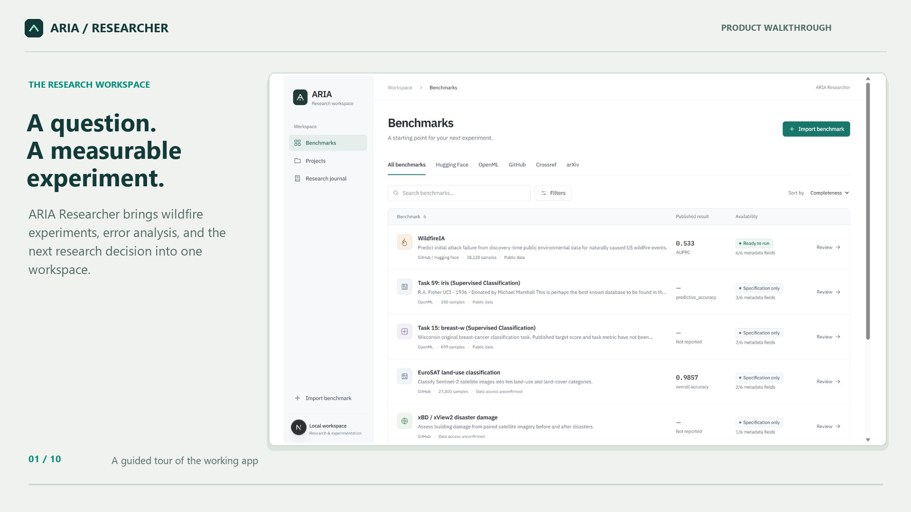

# Two-minute ARIA demo

[Download the MP4](aria-research-demo.mp4). Exactly 120 seconds, 1920×1080, H.264, 24 fps, silent captions. The full encoded video was decoded successfully; see [verification.json](verification.json).

The walkthrough uses real UI captures edited into ten scenes. It is not continuous screen recording. The saved ARIA explanation is visibly labeled as belonging to an earlier study. Comparison, subgroup, verification, and report scenes include actual recorded results. See [storyboard.json](storyboard.json) for scene text and [end-to-end evidence](../aria-expansion/END_TO_END.md).

